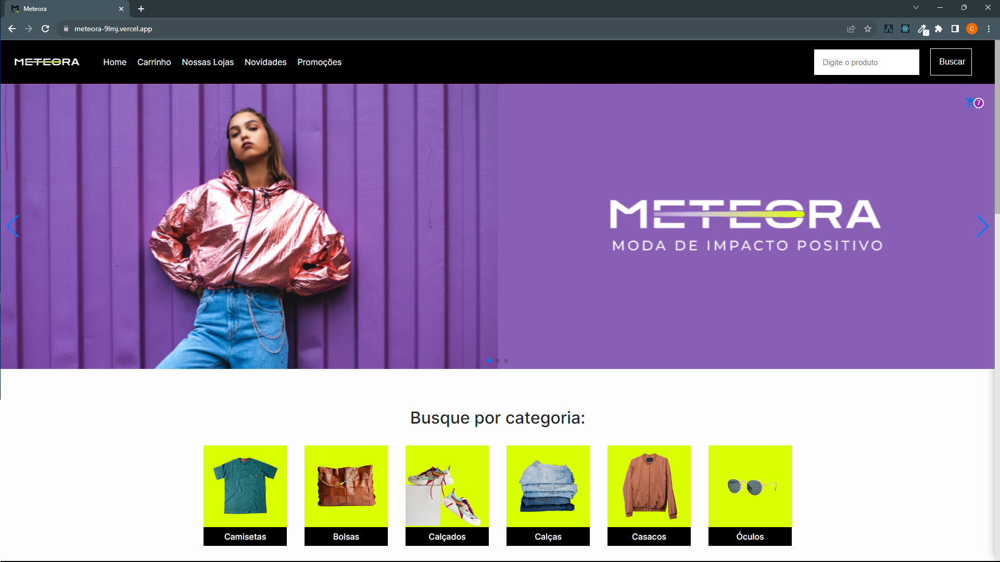
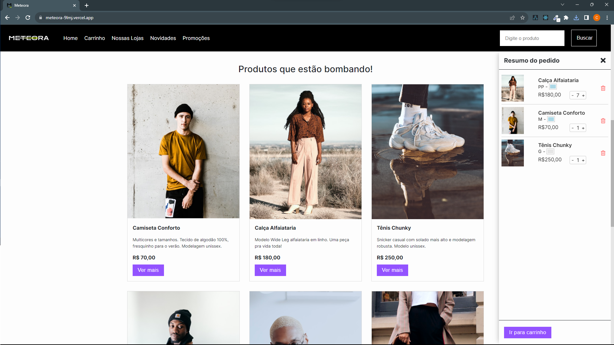
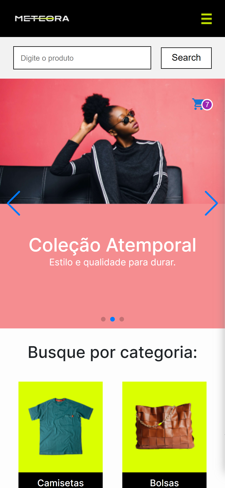

# Meteora

## [PT-BR] Introdução

Obrigado por visitar o Meteora, é um projeto pessoal de E-commerce baseado no Alura Challenge 7ª Edição

### Este é um projeto E-commerce, uma Single Page Application com diversos features feito em ReactJs garantindo uma ótima experiencia de usuário e com diversas boas práticas do desenvolvimento web e pode ser acessado pelo [link](https://meteora-9lmj.vercel.app)

### O projeto foi feito com React, CSS Modules, contando com as melhores práticas buscando performace, bons visuais e layout totalmente responsivo. As principais ferramentas utilizadas são: React Js, CSS Modules, leitura de dados de uma API vinda do Json Server, React-router-dom, React Icons, Context API, Hooks Customizados, useState e useEffect, Componentes do Material UI, carrsel feito com Swiper JS, Figma.

### Principais funcionalidades:

- Navegação suave entre as poaginas com o Single page application
- Banners dinamicos com carrosel do Swiper JS
- Lista de procutos gerada dinamicamente a partir dos dados de uma API
- Filtro de itens por categorias e por campo de pesquisa
- Detalhes dos produtos por um modal
- Seção de Newsletter
- Validação de todos os formulários (Newsletter e adicionar produto)
- Submenu mostrando o resumo dos itens do carrinho
- Página de checkout com todos os items do carrinho detalhados e valor total da compra

## [EN] Introduction

Thank you for having a look on Meteora project, this is an E-Commerce personal project based on the alura challenge 7th edition

### This is an E-Commerce project, Single page application with various features built with ReactJs, garanting a good user experience and a lot of good practices on Front-End. It can be accessed on the [link](https://meteora-9lmj.vercel.app)

### The project has been made with React, Css Modules, having the best practices looking for perfomrmace, good styling and responsive design. The main tools used are: ReactJs, CSS Modules, Fetching API from Json Server, React router dom, React Icons, Context API, Custom Hooks, useState and useEffect, Materail UI components, Banner with Swiper JS and Figma.

### Main features:

- Smooth navigation between pages via Single page apllication
- Carrousel with swiper Js
- List of products dymanically via API
- Filter products by searchbar and by clicking on the categories section
- Show each product on a modal
- Newsletter section
- Validation to all forms (Newsletter and Adding products to the cart)
- Cart aside screen showing the added items description
- Checkout page with all cart items and the total value to the shopping.

### Cart aside screen

### Mobile screen

## Installation:
        To install the app locally, clone the app and make sure you have node Installed.
        Follow the instructions bellow to run de dependences:

    - set jsxconfig.json "baseUrl": "src"
    - npm install
    - npm install react-router-dom
    - npm install react-icons --save
    - npm install @mui/material @emotion/react @emotion/styled
    - npm install swiper
    - npm run dev

## Techs:

 

  
  
   
   
 

 

### Developer: Cléber Severo

 
 

 
